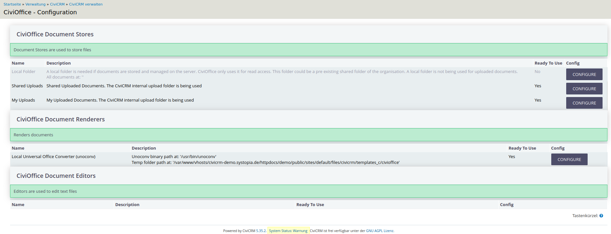

# Configuration

Configuration options can be found at Administration → Administration Console
→ Communication → CiviOffice Settings or `/civicrm/admin/civioffice/settings`.

**CiviOffice Document Stores** are locations where documents and templates are
stored. Currently, the built-in local document store is the only available
service. Future developments might integrate other Document Stores including
remote services.

**Document Renderers** are the internal services responsible for the processing
of documents.

The column *Ready To Use* gives feedback on the successful activation of a
component.

## Document Stores

These options for document storage are currently available:

1. **Local Folder**: A local folder is required if documents are stored on the
   server and managed independently by the server. This could be an existing
   document system or a Samba share. CiviOffice uses it for read-only access. A
   local folder is not used for uploaded documents and should not be confused
   with the Temp folder of the renderer.
2. **Shared Uploads**: Documents can be uploaded here for shared use in the
   organisation. If activated, it enables *all users* to upload documents.
3. **My Uploads**: Documents for the personal use of the CiviCRM user are stored
   here. At the least, this store should be activated for using CiviOffice.

## Document Renderers

The currently built-in renderers are *Local Universal Office Converter (
unoconv)* and *Local Universal Office Converter (unoconv) implementing PhpWord*.
The latter is required in order to convert HTML syntax to OOXML, the internal
standard of .docx.

You will have to enter the following:

- **The path to the binary of unoconv**: Usually this is `/usr/bin/unoconv`.
  The path can otherwise be determined with the following console
  command: ``which unoconv``.
- **The path to the temp folder**: A subfolder of
  CiviCRM's `templates_c` directory. As an example, on a Drupal-based site,
  this might look
  like `/var/www/vhosts/[YOUR_DOMAIN]/httpdocs/dev/public/sites/default/files/civicrm/templates_c/civioffice`

The directory, here named ``civioffice``, must be created manually in the
described path. Although the path (and name) might be set differently, we
recommend creating the directory inside `templates_c`.

You should also consider creating a lock file in order to synchronize access.

The path entry is verified dynamically, so saving is only possible when an
existing path is entered. In case of permission problems, you will receive a
warning with detailed information.

## Document Editors

(Editor modules are a planned feature, nothing to do here yet.)

## Live Snippets

This is explained [here](/inserting-content-with-live-snippets/). You do not
need any configured live snippets for CiviOffice to work.

**Example of a working configuration menu:**

