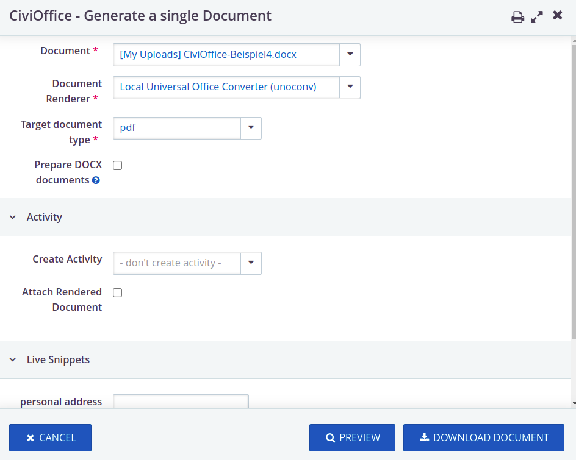
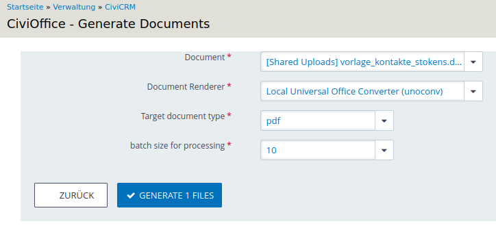

# Working With Documents

## Known issues

+ .docx files use an XML structure internally to describe formatting and other
  properties of text elements. In some cases, this can lead to CiviCRM tokens
  being split up by XML tags, making them infunctional. CiviOffice tries to
  mitigate this problem by optimizing the XML structure. However, there are some
  things that CiviOffice can not repair (yet). **In order to avoid issues, you
  should**
  + make sure there are no mixed formatting properties in your tokens (e.g. a
    portion of the token is in bold font)
  + disable spell checking in your documents, especially make sure you don't
    apply exceptions from spell checking to bits of your tokens

## Managing document templates

With the integrated document stores for personal and shared uploads, the
documents to be used as templates in CiviOffice can be managed via
`/civicrm/civioffice/document_upload`. (A user with admin privileges can add a
navigation menu item linked to that page.)

In future versions, other document stores can be added.

You can use CiviCRM tokens in your document templates. A page listing all the
tokens available in your system can be found at `/civicrm/civioffice/tokens`.
Note that it depends on the context whether or not a specific set of tokens is
actually available. For example, contribution tokens will *not* work when
operating on contacts (i.e. creating a document for a single contact, or many
documents from a contact search result).

### Available Documents

With the blue icon next to the the heading, you can switch between the stores
(*Shared Documents* / *Private Documents*), if both are configured. The table
shows the available documents of the selected store. These can be deleted or
downloaded under *Actions*.

### Upload More

If at least one document store is configured, a .docx file can be selected,
uploaded and made available to others using the common button.

## Creating a document for a single contact

In the overview for a single contact, the extension creates a new option in
the `Actions` menu, `Create CiviOffice document`. Clicking this menu item will
open a form where you choose some settings for your document processing:

- pick a document to be used as the template, a renderer to process it and the
  output format
- 'Prepare DOCX documents' repairs the internal structure of documents which can
  be malformed when created with MS Word (tokens are split up unnecessarily by
  XML elements and thus not being processed); there are no known downsides of
  using this option.
- choose whether you want to create an activity, and if so, whether to include
  the rendered document
- if there are any live snippets configured in your system, you can fill them
  here (read more about live
  snippets [here](/inserting-content-with-live-snippets/))

**Download document** will do just that and, if applicable, create an
activity. **Preview** will just give you the document to review, but not create
an activity.

## Creating documents for multiple contacts

From a contact search result, select the intended contact records. Then, select
the action **Create Documents** which will take you to similar form with
processing options. This is different from the form for a single contact:

- you can change the batch size for processing documents (leave unchanged unless
  you have issues with the processing speed)
- attaching files to activities is not supported (yet) as this can produce large
  amounts of data and thus harm the application by using up the hard drive space
- the download will produce a .zip archive containing the document for each
  contact

** After downloading, always use the 'Back to previous page' button in order to
delete the created document from the main memory and thus free up the memory
space. This is particularly important for larger processing runs.**

## Creating documents for contributions and participants

CiviOffice also provides search actions in contribution and participant search
results. The processing options are the same as in the contact search action,
however the data available through tokens will be different. For example, you
can use tokens for the contribution amount or the event title belonging to a
registration, respectively.

